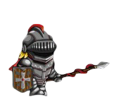
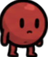
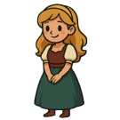
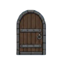

# Documento de Diseño: El Sacrificio de Glob

## Índice
1. [Conceptualización](#1-conceptualización)
    * [1.1. Historia](#11-historia)
    * [1.2. ¿Por qué hemos elegido este tema?](#12-por-qué-hemos-elegido-este-tema)
2. [Player (Glob)](#2-player-glob)
3. [ARTE](#3-arte)
    * [3.1. Visión General](#31-visión-general)
    * [3.2. Dirección de Arte y Contraste](#32-dirección-de-arte-y-contraste)
    * [3.3. Guía de Personajes y Entidades](#33-guía-de-personajes-y-entidades)
    * [3.4. Diseño de Niveles (Módulos) e Imágenes de Assets](#34-diseño-de-niveles-módulos-e-imágenes-de-assets)
4. [Inteligencia Artificial (IA) de Enemigos](#4-inteligencia-artificial-ia-de-enemigos)
    * [4.1. El Caballero](#41-el-caballero)
    * [4.2. El Rey](#42-el-rey)
5. [Sistemas de Progresión y Gestión](#5-sistemas-de-progresión-y-gestión)
    * [5.1. Llave y Puerta (Comunicación por Señales)](#51-llave-y-puerta-comunicación-por-señales)
    * [5.2. La Mazmorra Real (Cámara y Derrota)](#52-la-mazmorra-real-cámara-y-derrota)
    * [5.3. Coleccionables (Monedas)](#53-coleccionables-monedas)
6. [Distribución y Publicación](#6-distribución-y-publicación)

---

## 1. Conceptualización

### 1.1. Historia
En el corazón de la Castilla medieval, Lumi y Glob vivían una vida sencilla como campesinos, unidos por un amor que era la envidia de toda la comarca. Sin embargo, su paz se truncó cuando los heraldos del Rey llevaron noticias de la belleza de Lumi al castillo. El monarca, obsesionado con encontrar una esposa de linaje puro y voluntad dócil para su despiadado hijo, el Príncipe Ravik, ordenó su captura inmediata. Al llegar al salón del trono, el Rey intentó obligar a Lumi a aceptar un matrimonio forzoso. Ante la negativa de la joven, el Rey lanzó una maldición sobre Glob: su cuerpo se encogió y endureció hasta convertirse en una pelota roja, despojado de su humanidad pero conservando su conciencia y su determinación para rescatarla.

### 1.2. ¿Por qué hemos elegido este tema?
La respuesta es simple: **a los tres nos encantaban los juegos de este estilo**. Siempre nos han gustado esos juegos de aventuras y plataformas donde el control es directo y la historia te motiva a seguir adelante. Queríamos crear un juego que nosotros mismos disfrutaríamos jugando. Por eso diseñamos a Glob como un héroe humilde pero valiente; aunque lo transformen en una pelota, él no se rinde y sigue adelante andando y defendiéndose a puñetazos para rescatar a Lumi de las garras de Ravik.

---

## 2. Player (Glob)
Glob ha sido diseñado como un héroe humilde pero valiente que utiliza su forma circular para navegar por la mazmorra de manera dinámica y efectiva:
* **Controles**
  - a -> izquierda:
  - W -> saltar
  - d -> derecha
  - p ->atacar
* **Salto y Doble Salto:** Para enfatizar su agilidad como "pelota", Glob permite un segundo impulso en el aire. El código detecta si el personaje ya no está en el suelo y permite una segunda activación de la fuerza de salto, lo que facilita la superación de trampas y plataformas elevadas.
* **Ataque (El Puñetazo):** Aunque ha sido transformado, Glob conserva su determinación y se defiende a puñetazos. Esta habilidad activa un estado de ataque (`is_attacking`) que es la única forma de derrotar a los enemigos.
* **Interacción con Enemigos:** Si Glob toca a un enemigo mientras realiza su animación de puñetazo, el enemigo ejecuta su lógica de `morir_enemigo()`. Si el contacto ocurre fuera de este estado, Glob es derrotado y el nivel se reinicia automáticamente.

---

## 3. ARTE

### 3.1. Visión General
El juego adopta una estética 2D con un estilo "limpio" y semi-minimalista. El objetivo es que el jugador pueda identificar instantáneamente los elementos interactivos mientras asciende a gran velocidad, evitando objetos innecesarios que saturen la pantalla.

### 3.2. Dirección de Arte y Contraste
La clave visual del juego reside en los tonos oscuros con objetos antiguos de la época:
* **Fondos:** Se utilizarán tonos oscuros y apagados (como la pared de ladrillos de piedra grisácea) para generar una atmósfera de profundidad y encierro característica de una mazmorra.
* **Elementos Activos:** Los peligros (pinchos, enemigos) y los coleccionables (monedas) utilizarán una paleta de colores vibrantes para "saltar" a la vista sobre el fondo oscuro.

### 3.3. Guía de Personajes y Entidades
El estilo de los personajes es de tipo Cartoon/Chibi, con líneas de contorno definidas que facilitan la visibilidad:
* **Glob:** Personaje con forma circular de color rojo.
* **Enemigos:** Caballeros con lanza y un Rey con espada.

### 3.4. Diseño de Niveles (Módulos) e Imágenes de Assets
El mundo se construye de forma modular mediante plataformas de piedra, puertas de madera y monedas doradas con brillo propio.

**Galería de Assets y Capturas:**

 

 

 

---

## 4. Inteligencia Artificial (IA) de Enemigos

### 4.1. El Caballero
* **Detección de Abismos:** Utiliza nodos `RayCast2D` (`$detectorDerecho` e `izquierdo`). Si el sensor deja de colisionar con el suelo, el enemigo invierte su variable sentido, evitando caerse de las plataformas.
* **Filtro de Altura:** El enemigo solo activa el estado atacando si la diferencia en el eje Y con el jugador es menor a 30 píxeles (`abs(diff_y) < 30`), asegurando que solo persiga al jugador si están en el mismo nivel de plataforma.
* **Velocidad Variable:** Cambia dinámicamente entre `speed` (patrulla) y `chase_speed` (persecución) según la detección del jugador.

### 4.2. El Rey
* **Robustez del Código:** Emplea `is_instance_valid(jugador)` para evitar errores críticos de referencia si el jugador es eliminado de la escena mientras el jefe ejecuta su lógica de ataque.
* **Ángulo de Visión:** Solo inicia el ataque si el jugador está dentro del rango y físicamente frente a él, basándose en la dirección de su escala horizontal.
* **Gestión de Muerte:** Al morir, desactiva sus capas de colisión y el monitoreo del área (`set_deferred`), asegurando que el personaje no reciba daño por contacto con el cadáver durante la animación final.

---

## 5. Sistemas de Progresión y Gestión

### 5.1. Llave y Puerta (Comunicación por Señales)
* **La Llave:** Al detectar la colisión con el jugador, emite la señal `llave_recogida` y se elimina de la escena de forma segura con `call_deferred("queue_free")`.
* **La Puerta:** Conectada mediante la señal de la llave. Al recibirla, cambia la variable booleana `tiene_llave` a true y ejecuta la animación de apertura. El cambio de escena solo se permite si esta condición se cumple.

### 5.2. La Mazmorra Real (Cámara y Derrota)
* **Límites de Cámara:** El script define manualmente los márgenes (`limit_left`, `limit_top`, `limit_right`, `limit_bottom`) para encuadrar la acción y ocultar los bordes del escenario.
* **Condición de Derrota:** Utiliza la señal `screen_exited` del nodo `VisibleOnScreenNotifier2D` del jugador. Si el personaje cae o sale de la vista, se ejecuta `get_tree().reload_current_scene()`.

### 5.3. Coleccionables (Monedas)
* **Persistencia (Global.gd):** Se utiliza un script **Autoload** que mantiene una lista persistente de los IDs únicos de las monedas recogidas. Esto garantiza que los objetos no reaparezcan tras un reinicio de nivel.
* **Lógica de Recolección:** Al instanciarse (`_ready`), cada moneda verifica su presencia en la lista global; si ya fue recogida, se auto-elimina instantáneamente.
* **Interfaz (HUD):** El contador visual se actualiza transformando el valor entero de monedas en una cadena de texto para el nodo Label correspondiente.

---

## 6. Distribución y Publicación

### 6.1. Multiplataforma y Accesibilidad
Gracias a la flexibilidad de Godot Engine, el juego es exportable a múltiples entornos:
* **Versión PC (Windows/Linux):** Ejecutable optimizado para rendimiento máximo.
* **Versión Web (HTML5):** Accesible directamente desde navegadores sin necesidad de descarga.

### 6.2. Canales de Distribución Seleccionados
* **Itch.io:** Portal de referencia para la comunidad indie para recibir feedback.
* **Página Web Propia:** Repositorio central para el lore, capturas de alta definición y descargas oficiales.

